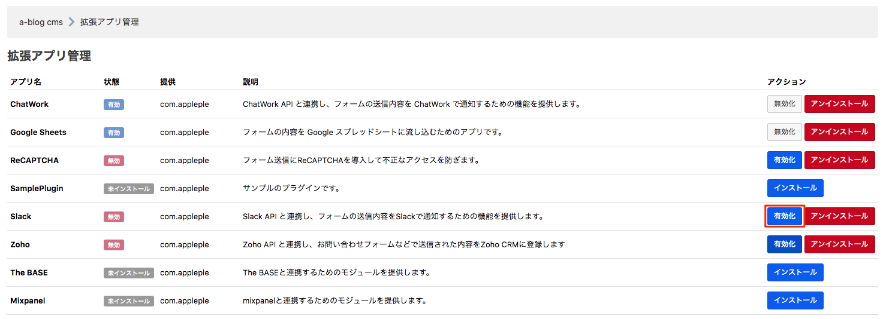
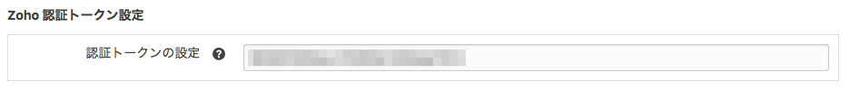
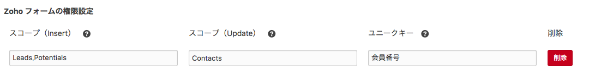
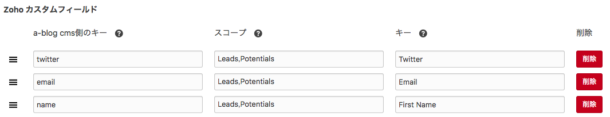

# Zoho for a-blog cms

Zoho CRM とはオンラインの顧客管理システムです。a-blog cmsのフォームと連携することによってお客様が入力した情報をZoho CRM 上に蓄積することができます。

## ダウンロード
[Zoho for a-blog cms](https://github.com/appleple/acms-zoho/raw/master/build/Zoho.zip)


以下の3つのステップでa-blog cmsとzohoを連携します。

1. Zoho CRMの登録
2. 認証トークンの取得
3. a-blog cmsの拡張アプリ zoho に認証トークンを登録

## 1. Zoho CRMの登録

まずは[Zoho CRM](https://www.zoho.com/crm/) に登録します。機能は制限されますが、無料版がありますのでアカウントがない人はまずは無料版を使ってみましょう。

## 2. 認証トークンの取得と登録

[https://crm.zoho.com/crm/ShowSetup.do?tab=devSpace&subTab=api&action=developerapi](https://crm.zoho.com/crm/ShowSetup.do?tab=devSpace&subTab=api&action=developerapi)にて認証トークンを作成します。下の画像の歯車アイコンをクリックすると認証とクーくんを作成という項目が出てきます。


その項目をクリックすると、「認証トークン」作成用のモーダルウィンドウが出現しますので、そこに任意のアプリケーション名を入力し、作成ボタンを押すことで認証トークンが取得できます。ただしアプリケーション名は英語にしてください。 この認証トークンをあとで使いますので覚えておいてください。


## 3. a-blog cmsの拡張アプリ zoho に認証トークンを登録

管理ページ > 拡張アプリ より「拡張アプリ管理」のページに移動します。そのページより下の図のようにZohoをインストールします。



インストール完了後は、管理ページ > ZohoよりZohoの管理ページに移動します。その後、「認証トークンの設定」という項目がありますので、その項目に先ほど覚えておいた認証トークンを入力します。 これでa-blog cmsとZohoを連携させる準備は整いました。

### 注意

config.server.phpでHOOKを有効にしておく必要があります

```php
define('HOOK_ENABLE', 1);
```



## 拡張アプリZohoの使い方

1. Formの権限設定
2. Zohoのカスタムフィールドの設定

### 1. Formの権限設定

フォームIDごとに、Zohoのどのスコープに対してInsert（データの挿入）及びUpdate（データの更新）ができるかを設定できます。例えば、下の画像の場合、Leads及び、Potentialsのスコープに対してInsert権限があり、Contactsのスコープに対してはUpdate権限があります。



### 2. Zohoのカスタムフィールドの設定

次は、カスタムフィールドの設定です。ここではa-blog cmsのフォーム側の変数とZoho側のカスタムフィールドの紐付けを行います。例えば、一番最初の列では、twitterの項目はzoho側のLeadsとContactsのスコープのTwitterに対応しています。



