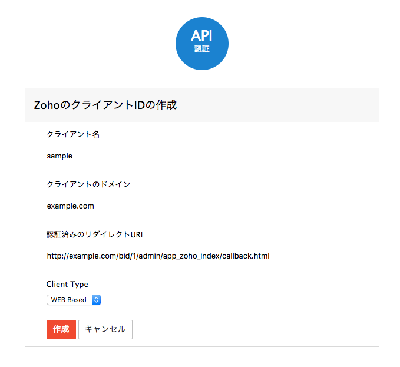
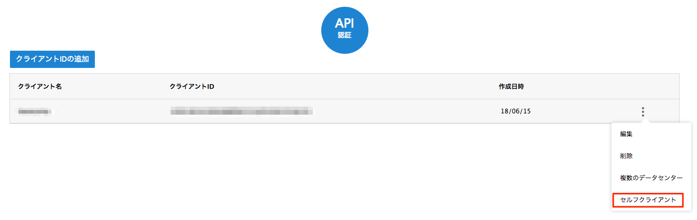
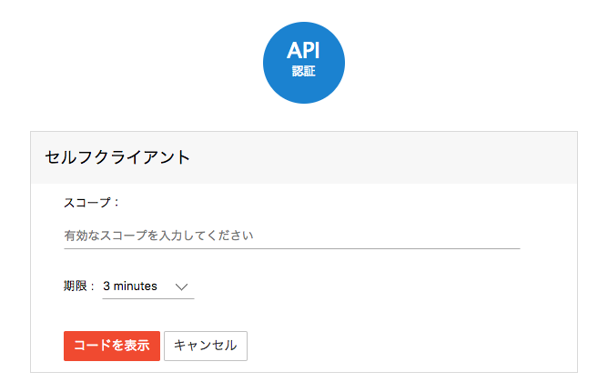
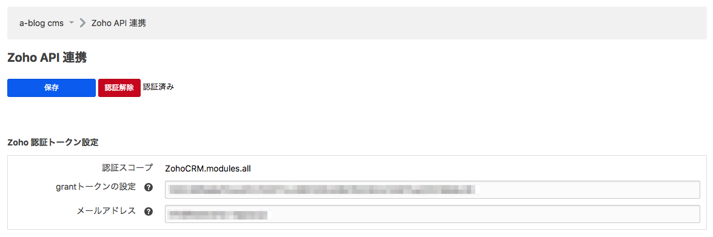

# Zoho for a-blog cms

Zoho CRM とはオンラインの顧客管理システムです。a-blog cmsのフォームと連携することによってお客様が入力した情報をZoho CRM 上に蓄積することができます。

## ダウンロード
[Zoho for a-blog cms](https://github.com/appleple/acms-zoho/raw/master/build/Zoho.zip)


## 設定

下記のURLより、クライアントIDを追加します。
[https://accounts.zoho.com/developerconsole](https://accounts.zoho.com/developerconsole)



設定後は、先ほど追加したクライアントに対して、セルフクライアントの設定をします。



スコープには`ZohoCRM.modules.all`と入力してください。期限は何分でも構いませんが、その期限内にoAuth認証を済ませる必要があります。入力をすませると、oAuth認証に必要なgrantトークンが表示されるはずです。このトークンを覚えておきましょう。



先ほどのgrantトークンをa-blog cmsの管理画面 > 拡張メニュー > Zoho より入力します。zohoの登録で使用しているメールアドレスもここで入力しておく必要があります。
入力後は設定を保存し、「認証」ボタンをクリックします。無事に認証ができると、下の図のように「認証済み」というラベルが表示されるはずです。



### 注意

config.server.phpでHOOKを有効にしておく必要があります

```php
define('HOOK_ENABLE', 1);
```


## 拡張アプリZohoの使い方

1. Formの権限設定
2. Zohoのカスタムフィールドの設定

### 1. Formの権限設定

フォームIDごとに、Zohoのどのスコープに対してInsert（データの挿入）及びUpdate（データの更新）ができるかを設定できます。例えば、下の画像の場合、Leads及び、Potentialsのスコープに対してInsert権限があり、Contactsのスコープに対してはUpdate権限があります。


### 2. Zohoのカスタムフィールドの設定

次は、カスタムフィールドの設定です。ここではa-blog cmsのフォーム側の変数とZoho側のカスタムフィールドの紐付けを行います。例えば、一番最初の列では、twitterの項目はzoho側のLeadsとContactsのスコープのTwitterに対応しています。


