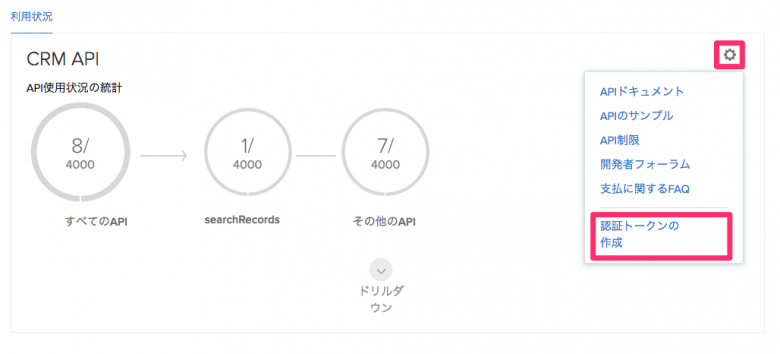
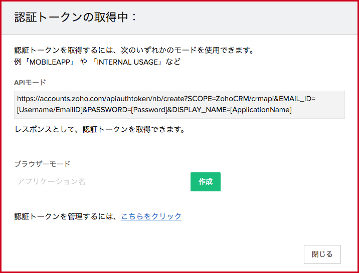

# Zoho for a-blog cms

Zoho CRM とはオンラインの顧客管理システムです。a-blog cmsのフォームと連携することによってお客様が入力した情報をZoho CRM 上に蓄積することができます。

以下の3つのステップでa-blog cmsとzohoを連携します。

1. Zoho CRMの登録
2. 認証トークンの取得
3. a-blog cmsの拡張アプリ zoho に認証トークンを登録

## 1. Zoho CRMの登録

まずは[Zoho CRM](https://www.zoho.com/crm/) に登録します。機能は制限されますが、無料版がありますのでアカウントがない人はまずは無料版を使ってみましょう。

## 2. 認証トークンの取得と登録

[https://crm.zoho.com/crm/ShowSetup.do?tab=devSpace&subTab=api&action=developerapi](https://crm.zoho.com/crm/ShowSetup.do?tab=devSpace&subTab=api&action=developerapi)にて認証トークンを作成します。下の画像の歯車アイコンをクリックすると認証とクーくんを作成という項目が出てきます。

その項目をクリックすると、「認証トークン」作成用のモーダルウィンドウが出現しますので、そこに任意のアプリケーション名を入力し、作成ボタンを押すことで認証トークンが取得できます。ただしアプリケーション名は英語にしてください。 この認証トークンをあとで使いますので覚えておいてください。

## 3. a-blog cmsの拡張アプリ zoho に認証トークンを登録

管理ページ > 拡張アプリ より「拡張アプリ管理」のページに移動します。そのページより下の図のようにZohoをインストールします。

