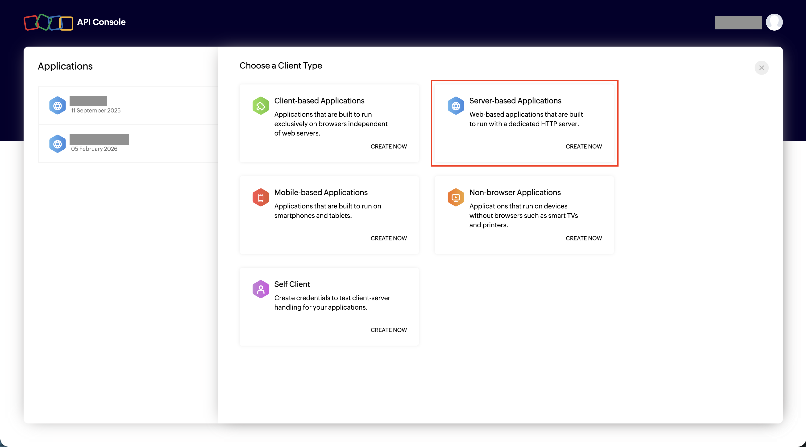
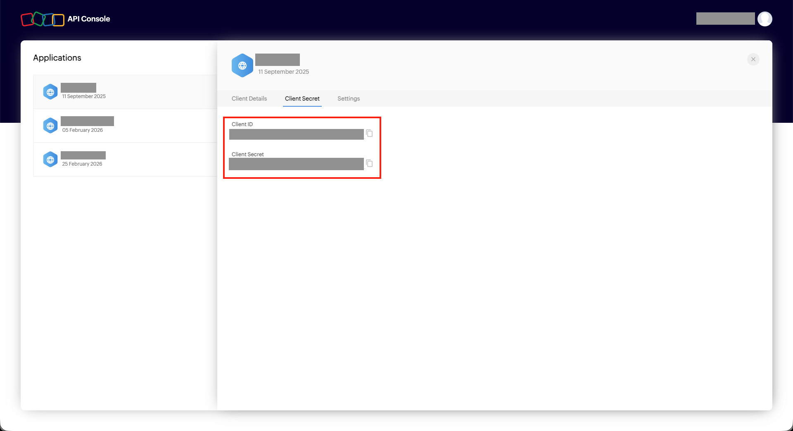
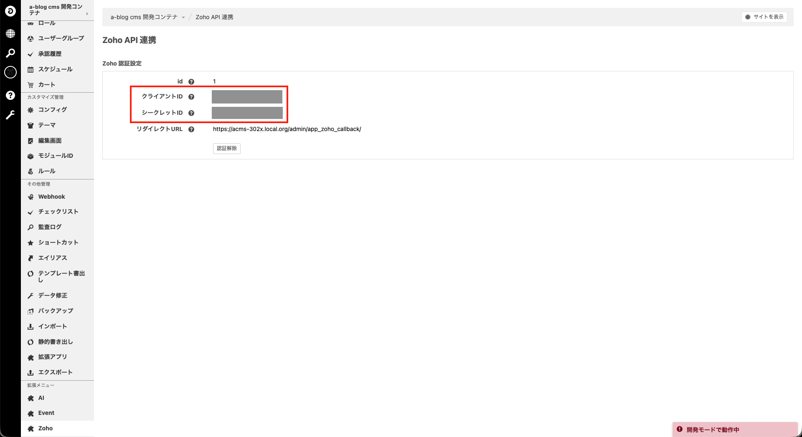
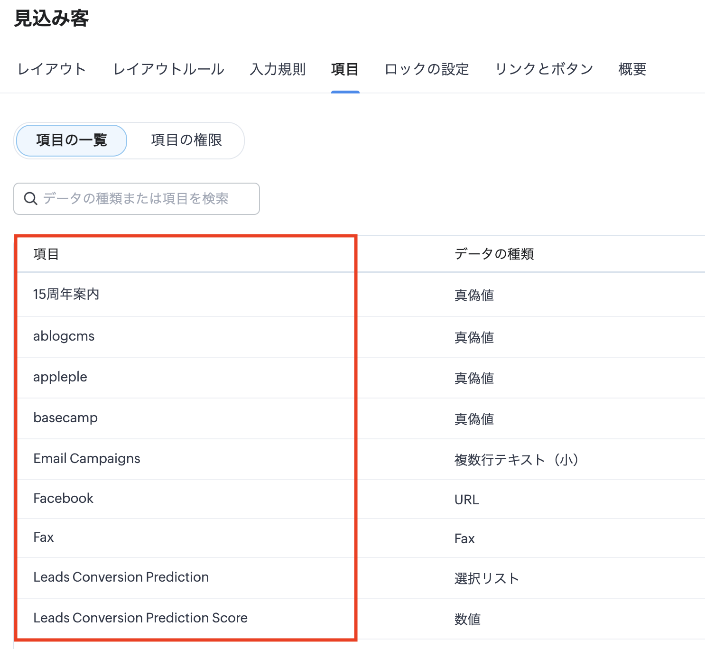
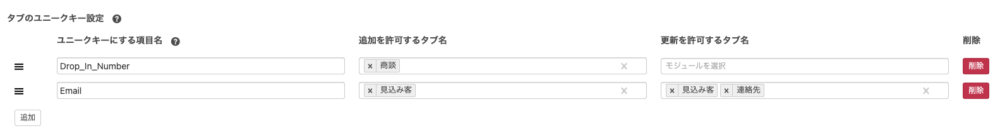
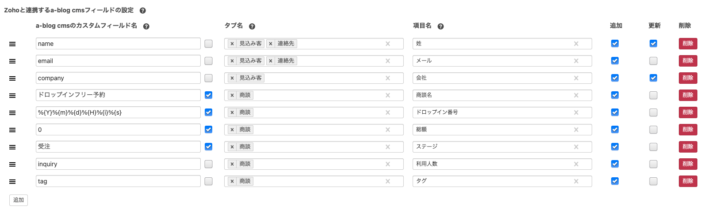
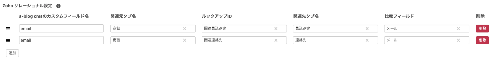

# Zoho for a-blog cms

Zoho CRM とはオンラインの顧客管理システムです。a-blog cmsのフォームと連携することによってお客様が入力した情報をZoho CRM 上に蓄積することができます。

## ダウンロード

[Zoho for a-blog cms](https://github.com/appleple/acms-zoho/raw/master/build/Zoho.zip)

## 動作環境

- a-blog cms: Ver. 3.2.x (3.3+ not tested yet)
- PHP: 8.1 – 8.4 (8.5+ not tested yet)

## インストール

1. ダウンロードしたファイルを解凍し、`Zoho` ディレクトリを a-blog cms の `extensions` ディレクトリに配置します。
2. 管理画面にログインし、`拡張アプリ管理` から `Zoho` をインストールします。

### 注意

config.server.php で HOOK_ENABLE を有効にしておく必要があります。

```php
define('HOOK_ENABLE', 1);
```


## 認証

Zoho CRM との連携にはOAuth認証が必要です。OAuth認証を行うためには、Zoho CRM のAPIを利用するためのクライアントを作成する必要があります。

### 認証コードの生成

下記のURLより API Console 画面を開きます。<br>
[https://api-console.zoho.com/](https://api-console.zoho.com/)

初めてAPI追加する場合は「GET STARTED」から登録画面に遷移してください。
クライアント作成画面に遷移すると、Client Type 選択画面が表示されます。ここでは「Self client」を選択してください。



Client ID と Client Secret はあとでCMS側に入力するので控えておきます。



### OAuth認証

次に、CMS側でOAuth認証を行います。

#### envファイルの設定

a-blog cms 設置ディレクトリの .env ファイルに以下の情報を設定します。
以下の設定は任意で、それぞれ初期値が用意されています。

```
# トークンファイルの保存先ディレクトリ
# 未設定時はドキュメントルートを使用
ZOHO_TOKEN_PERSISTENCE_PATH=

# Zoho SDK ログの出力先ファイルパス
# 未設定時はドキュメントルートにphp_zoho_sdk.logが出力
ZOHO_LOGGER_FILE_PATH=

# Zoho API レスポンスのキャッシュ有効期間（秒）
# 未設定時は3600
ZOHO_CACHE_LIFETIME=
```

#### 認証

次に、先ほど取得した、Client ID、Client Secretを拡張アプリ管理画面から入力していきます。

入力後は設定を保存し、「認証」ボタンをクリックします。クリックすると、認証トークンを入力するプロンプトが表示されるので、API Console で取得した認証トークンを入力して認証を行います。

認証が完了すると、下の図のように「認証済み」というラベルが表示され、認証に利用しているZohoアカウントに設定されているメールアドレスが表示されます。




## 拡張アプリZohoの使い方

管理画面 > フォーム管理 > 設定したいフォームID よりフォームに対するZohoの設定を行うことができます。<br>
a-blog cmsのフォームから送信されたカスタムフィールドのフィールド名に対してZohoの項目のラベルを紐づけることで、a-blog cms側のフォームの送信結果をZohoに送信することができます。

Zohoの項目のラベルは設定 > タブと項目から確認できます。



以下3つの作業が必要になります。

1. フォームの権限設定
2. Zoho カスタムフィールドの設定
3. Zoho リレーショナル設定

### 1. タブのユニークキー設定

フォームIDごとに、Zohoのどのタブに対してデータの作成及びデータの更新ができるかを設定できます。
設定するにはAPI項目名が必要ですので、ZohoCRMの設定から 開発者向け情報 > APIとSDK で設定したいタブから項目のAPI名を確認してください。

例えば、下の画像の場合、商談タブの Drop_In_Number項目がユニークキーになっており、ユニークキーが共通のタブ同士の場合は、Emailのようにまとめて設定することができます。



### 2. Zohoと連携するa-blog cmsフィールドの設定

次は、カスタムフィールドの設定です。ここでは a-blog cms のフォームから送信されたカスタムフィールドのフィールド名とZoho側のカスタムフィールドの項目のラベルの紐付けを行います。

例えば、一番最初の列では、nameの項目はZohoの 見込み客タブ と 連絡先タブ の 姓 に対応しています。

a-blog cmsのカスタムフィールド名横にあるチェックボックスにチェックを入れることで、フィールドに指定したテキストをそのまま送信できるようになります。また、グローバル変数も対応しています。

フォームの権限設定で追加するタブを設定している場合は、Zohoと連携するa-blog cmsフィールドの設定に、ユニークキーになる項目のラベルを追加し、追加を有効にしてください。

また、フォームの権限設定で更新するタブを設定している場合は、Zohoと連携するa-blog cmsフィールドの設定に、ユニークキーになるものの項目を追加し、更新を有効にしてください。



### 3. Zoho リレーショナル設定

また、Zoho側に登録したデータどうしをlookupIDを通して紐づけることができます。

例えば商談タブに、見込み客または連絡先に登録されているユーザーの情報（誰との商談なのか）を紐付けることができます。以下の画像では、商談の関連見込み客というルックアップID（フィールド）に、見込み客タブのメール情報で比較して紐づけています。



## フック

Zoho プラグインでは以下のフックポイントを提供しています。

### beforeZohoRequest

Zoho CRM へのデータ送信前に呼ばれます。

**引数**
- `$postModule` : ACMS_POST_Form_Submit インスタンス

### afterZohoRequestSuccess

Zoho CRM へのデータ送信が成功した後に呼ばれます。

**引数**
- `$postModule` : ACMS_POST_Form_Submit インスタンス

### afterZohoRequestError

Zoho CRM へのデータ送信でエラーが発生した場合に呼ばれます。

**引数**
- `$postModule` : ACMS_POST_Form_Submit インスタンス
- `$throwable` : 発生した例外オブジェクト

### afterZohoRequest

Zoho CRM へのデータ送信処理の完了後(成功/エラー問わず)に呼ばれます。

**引数**
- `$postModule` : ACMS_POST_Form_Submit インスタンス
