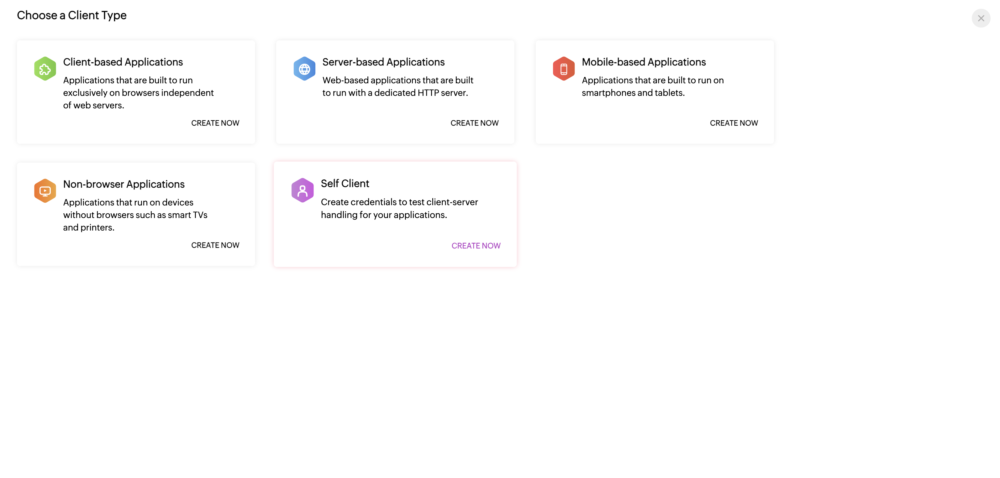
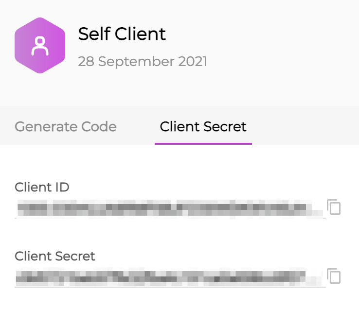
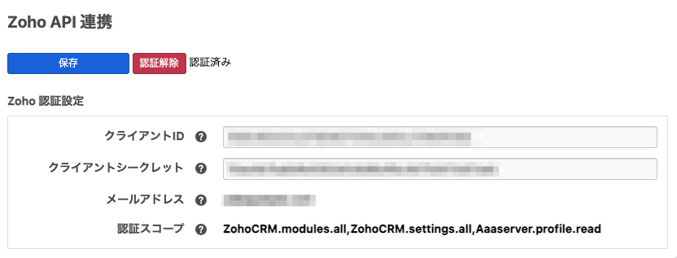
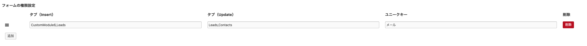
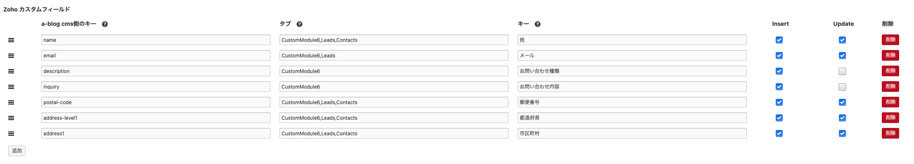

# Zoho for a-blog cms

Zoho CRM とはオンラインの顧客管理システムです。a-blog cmsのフォームと連携することによってお客様が入力した情報をZoho CRM 上に蓄積することができます。

## ダウンロード

[Zoho for a-blog cms](https://github.com/appleple/acms-zoho/raw/master/build/Zoho.zip)

## 動作環境

- a-blog cms >= 3.0.0
- php >=7.4

## インストール

1. ダウンロードしたファイルを解凍し、`Zoho` ディレクトリを a-blog cms の `extensions` ディレクトリに配置します。
2. 管理画面にログインし、`拡張アプリ管理` から `Zoho` をインストールします。

### 注意

config.server.php で HOOK_ENABLE を有効にしておく必要があります。

```php
define('HOOK_ENABLE', 1);
```


## 認証

Zoho CRM との連携にはOAuth認証が必要です。OAuth認証を行うためには、Zoho CRM のAPIを利用するためのクライアントを作成する必要があります。

### 認証コードの生成

下記のURLより API Console 画面を開きます。<br>
[https://api-console.zoho.com/](https://api-console.zoho.com/)

初めてAPI追加する場合は「GET STARTED」から登録画面に遷移してください。
クライアント作成画面に遷移すると、Client Type 選択画面が表示されます。ここでは「Self client」を選択してください。



Client ID と Client Secret はあとでCMS側に入力するので控えておきます。



Generate Code タブを開いてトークン生成します。

タブには `ZohoCRM.modules.all,ZohoCRM.settings.all,Aaaserver.profile.read` と入力してください。<br>
期限は何分でも構いませんが、その期限内にOAuth認証を済ませる必要があります。<br>
入力をすませるとOAuth認証に必要な認証用トークンが表示されるはずです。このトークンを覚えておきましょう。


※API を CREATE した時に「You are not a part of any ZohoCRM service orgs. Please remove the scope to generate the token.」と出る場合は Zoho CRM が未登録になっているので先にCRMへの登録をしてください。<br>
[https://crm.zoho.com/crm/ShowHomePage.do](https://crm.zoho.com/crm/ShowHomePage.do)

### OAuth認証

次に、CMS側でOAuth認証を行います。

#### envファイルの設定

a-blog cms 設置ディレクトリの .env ファイルに以下の情報を設定します。

- Zohoのアクセストークンを保存するディレクトリ
- Zohoのアプリケーションログを保存するディレクトリ

```
# Zohoの設定

## Zohoのアクセストークンを保存するディレクトリを指定します。ドキュメントルートより上の階層など、外部からアクセスできない場所を指定してください。
ZOHO_TOKEN_PERSISTENCE_PATH=/path/to/your/directory/

## Zohoのアプリケーションログを保存するディレクトリを指定します。ドキュメントルートより上の階層など、外部からアクセスできない場所を指定してください。
ZOHO_APPLICATION_LOG_FILE_PATH=/path/to/your/directory/
```

ZOHO_TOKEN_PERSISTENCE_PATH が指定されていない場合、拡張アプリ管理画面に以下のアラートが表示されます。


#### 認証

次に、先ほど取得した、Client ID、Client Secretを拡張アプリ管理画面から入力していきます。

入力後は設定を保存し、「認証」ボタンをクリックします。クリックすると、認証トークンを入力するプロンプトが表示されるので、API Console で取得した認証トークンを入力して認証を行います。

認証が完了すると、下の図のように「認証済み」というラベルが表示され、認証に利用しているZohoアカウントに設定されているメールアドレスが表示されます。




## 拡張アプリZohoの使い方

管理画面 > フォーム管理 > 設定したいフォームID よりフォームに対するZohoの設定を行うことができます。<br>
a-blog cmsのフォームから送信されたカスタムフィールドのフィールド名に対してZohoの項目のラベルを紐づけることで、a-blog cms側のフォームの送信結果をZohoに送信することができます。

Zohoの項目のラベルは設定 > タブと項目から確認できます。


以下3つの作業が必要になります。

1. フォームの権限設定
2. Zoho カスタムフィールドの設定
3. Zoho リレーショナル設定

### 1. フォームの権限設定

フォームIDごとに、Zohoのどのタブに対してInsert（データの作成）及びUpdate（データの更新）ができるかを設定できます。

例えば、下の画像の場合、Leads,CustomModule6のタブに対してデータ作成の権限があり、Leads,Contactsのタブに対してはデータ更新の権限があります。



### 2. Zoho カスタムフィールドの設定

次は、カスタムフィールドの設定です。ここでは a-blog cms のフォームから送信されたカスタムフィールドのフィールド名とZoho側のカスタムフィールドの項目のラベルの紐付けを行います。

例えば、一番最初の列では、nameの項目はZohoのCustomModule6,Leads,Contactsのタブの 姓 に対応しています。

フォームの権限設定でInsertするタブを設定している場合は、カスタムフィールド設定にユニークキーになる項目のラベルを追加しInsertを有効にしてください。

また、フォームの権限設定でUpdateするタブを設定している場合は、カスタムフィールド設定ユニークキーになるものの項目を追加しUpdateを有効にしてください。



### 3. Zoho リレーショナル設定

また、Zoho側に登録したデータどうしをlookupIDを通して紐づけることができます。

例えば、そのお問い合わせをしたユーザー（Zohoに登録されているまたは、お問い合わせと同時に登録されたユーザー）が誰なのかをルックアップIDを使って以下のように紐づけます。

ルックアップIDにはそのルックアップIDに使用されているZoho側のラベル名を登録します。


## トラブルシューティング

拡張アプリのソースコードを Git で管理している場合、拡張アプリ内に環境に依存するファイルが含まれているため、不具合が発生する可能性があります。

そのため、以下ファイルを .gitignore で除外してください。

- /extension/plugins/Zoho/vendor/zohocrm/php-sdk/src/resources
- /extension/plugins/Zoho/vendor/zohocrm/php-sdk/src/com/zoho/oauth/logger/
